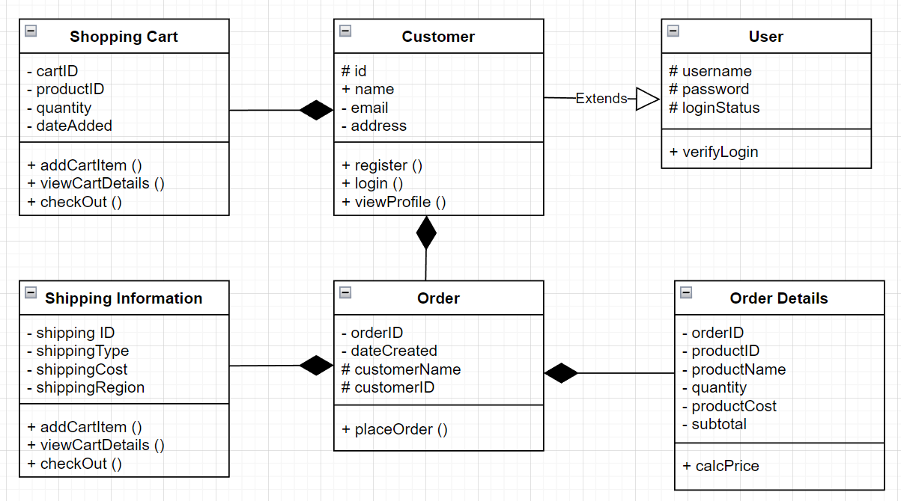
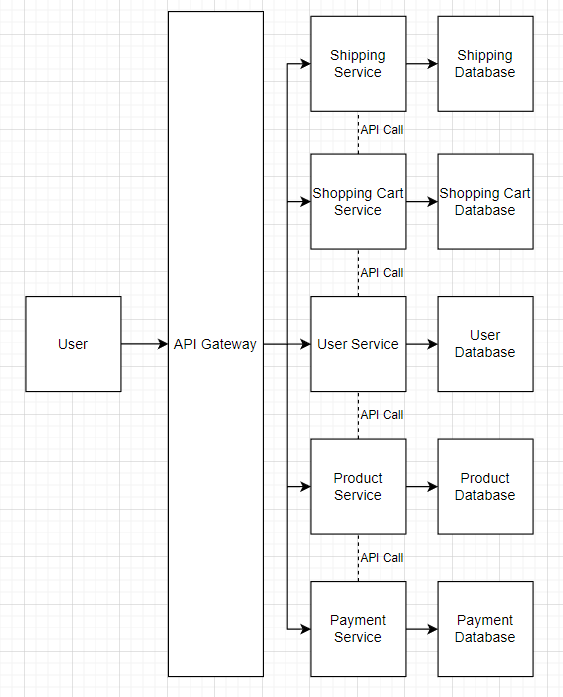
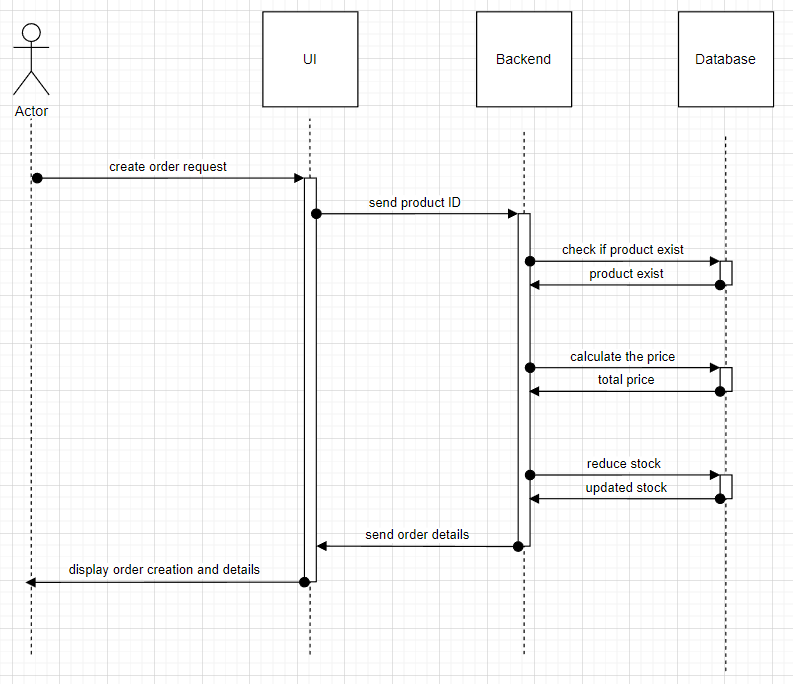

# E-Commerce Design Assignment

## High Level Design



Above is the high level design for part of simplified e-commerce system using class diagram.

- Client/Customer is assigned with ID, name, email, and address. Those informations are usually needed for registering their account.
- User class is extended and used in order for customer to log their accounts in.
- Order details and shipping information are part of order.

As for the design system architecture, I am using Microservice Architecture. Here is the design based from my high level design:



This design can be used especially when our company grows really big and quick, and we need more stable service in order to keep the company running. Each service has its own database and backend, and everything is communicated through API gateways if one service wants to access information of other database. It is not recommended for smaller startups to use this design, as it is much more complex and harder to manage with few developers. However, bigger ones will benefit more greatly.
This system design offers benefits such as:

1. Scaling particular services as needed, where we can stabilize any performance issue. Especially if one service was something reallu huge and requires more work, they can be scaled within its own server so any issues won't be propagating through other ones.
2. Any features can be loosely coupled, where we can develop and deploy any service independently without causing much trouble.
3. Codebase for each server will be smaller and simpler, where any developers can understand it pretty easily and can detect any problem much quicker.

All informations above are based from

## Create Order

### Sequence diagram of creating order

Here is the flowchart for creating order using sequence diagram



### Pseudo code

Here is the pseudo code based from the flowchart

```pseudocode
function createOrder(products) {
    let totalPrice = 0
    for each product in product database
        totalPrice equals to total price plus productPrice
        product quantity added 1 each
}

    return totalPrice
    return products
```

`createOrder()` is the main function within this operation. Assuming the product is exist in database, this function runs every variable needed, such as `products` and `totalPrice` and it will display the product names, its quantity, and prices.

### Complexity Analysis

Complexity of the function above is O(n) because generally any loop function is O(n), but based from the function above, we need to loop every products in the array, thus each product available in database means more loop happens. This function will work just fine as long as the products (n) is still in manageable numbers (<1000 is desirable).
